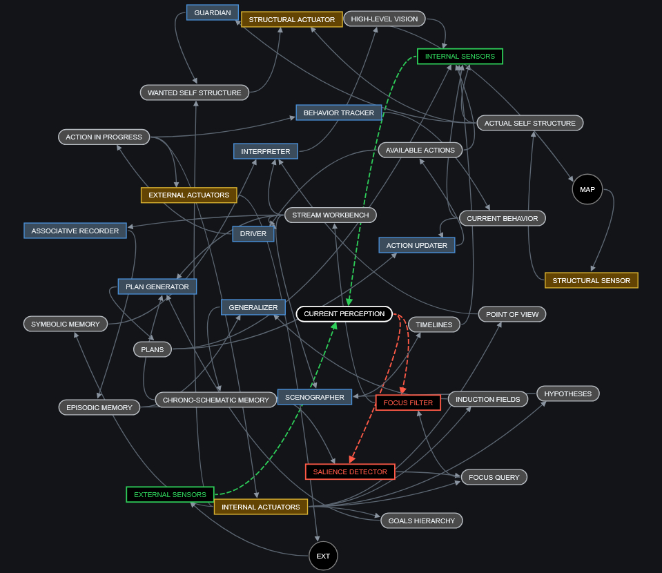

# RoverBanks





## What it is

It's a Turing-complete language for string content transformation and flow.

String content is called a frame. During execution, this content will be transformed into other content, continuously.

There are several "banks", holding content. There are several "rovers", which consume and feed the content of these banks. For this flow, a form of observer pattern is used, somewhat like a real-time spreadsheet.

There are two special banks: MAP and EXT. The EXT bank is the input/output of the system, allowing it to interact with its environment.

The content of EXT is read by the environment, and updated by the environment at a regular frequency.


## Data types

| Type | Syntax | Notes |
|---|---|---|
| Table | `( )` | array, object/dictionary, and set at once — access style determines which |
| Script | `{ }` | a sequence of computations |
| Frame | `[ ]` | text content; the base type of a source file |
| Source | `$` prefix | a reference to external content (see below) |

Texts and numbers belong to the "frame" type.


## Sources

A source is a resource containing either:
- RiverBanks source code,
- Javascript code,
- Some generative AI.

Banks are themselves sources too.

To access the content of a source for reading or writing, you give the URL of the source prefixed with `$`.

```
    $[lib/my source code.rbfs] -> [my_code]
```

When the content of a source is updated, this triggers an update of all frames referencing it.


## Tables

A table is at once an array, an object or dictionary, and a set. The distinction is made by the choice of functions used to access it for reading/writing.

The key of a table is always converted to a frame.

```
    (
        one,
        [two and a half],
        3, 4, 5,
        seven: 7,
        {4 + 4}: [eight],
        nine: ([some], [sub], [table])
    )
```


## Scripts

A script is denoted between braces.

The value of a script is a table containing the results of all its computations (and not simply the last one obtained, or the value indicated by a "return" as is often the case).

```
    {
        [sum] <- { {0} + {1} }

        uppercase[Math:]
        [4 + 4 =]
        sum(4, 4)
    }

=>  ( {}, [MATH:], [4 + 4 =], 8 )
```

This result is then converted to a frame, is the script appears in a frame.

```
=>  [MATH: 4 + 4 = 8]
```


## The frame

A frame is denoted between brackets.

The frame is a value of text type.

It can contain:
- text,
- a number,
- scripts, which will be replaced by their value, and
- nested frames, which will be embedded as-is.

```
    [
        The result of
        [{ 4 + 4 }]
        is
        { 4 + 4 }.
    ]

=> [The result of { 4 + 4 } is 8.]
```

The content of a file is considered a frame: this is the base type of a RoverBanks script.

As in HTML, several consecutive spaces and line breaks are replaced by a single space. The result is trimmed.


## Accessing the content of a table: `(...)[]`

You can access the content of a table by following it with a frame with no space separating them.

```
    (
        one,
        [two and 3],
        4, 5,
        seven: 7,
        {4 + 4}: [eight],
        nine: ([some], [sub], [table])

    )[/nine/0]

=>  [some]
```

If the 1st character of the address is a slash, this activates graphmaster mode. In this mode:
- The address is slash/separated. At each slash: child node.
- The keys of the tables read can be treated as wildcards.

Wildcards below are listed in increasing priority — an exact match always wins over a fallback:

| Wildcard | Description |
|---|---|
| `*` | Default key: used if no match is found |
| `%` | Default index: used if no numeric key is found |
| `\|a\|b` | Synonyms: a key having several "names" |
| `abc123` | Exact key or index: always highest priority |


## Applying a table to a frame: `[...]()`

It is possible to "apply" a table to a frame, by following the frame with the table with no space separating them. This is somewhat like a function call, or a macro.

```
    [
        This {bar} a {foo}.
    ](
        ( foo: [pipe], bar: [is not] ),
        ( foo: [sentence], bar: [is] ),
    )

=>  (
        [This is not a pipe.],
        [This is a sentence.]
    )
```

The tables provided as a suffix are accessible throughout the frame, forming the "local scope" of the frame. This is therefore a multi-layer scope, each layer containing a possible universe. This is the frame's "multiscope".

It can also be done anonymously.

```
    [
        This {1} a {0}.
    ](
        ( [pipe], [is not] ),
        ( [sentence], [is] ),
    )

=>  (
        [This is not a pipe.],
        [This is a sentence.]
    )
```


## Applying a table to a table of frames: `(...)()`

A table can be applied to a list of frames to deduce a frame and its multiscope. This is a pattern generator.

```
    (
        [This is not a pipe.],
        [This is a sentence.]

    )()

=>  (
        [
            This {0} a {1}
        ],
        (
            ( [is not], [pipe.] ),
            ( [is], [sentence.] ),
        )
    )
```

Names can also be provided for the lvars. Order is preserved. If there aren't enough names, it continues in anonymous mode (e.g. foo, bar, 0, 1, 2...).

```
    (
        [This is not a pipe.],
        [This is a sentence.]

    )([foo], [bar])

=>  (
        [
            This {foo} a {bar}
        ],
        (
            ( foo: [is not], bar: [pipe.] ),
            ( foo: [is], bar: [sentence.] ),
        )
    )
```


## Manipulating local multiscope variables

A script contained in a frame can also read and write variables in the scope of that frame.

Example:
```
    [
        {
            [result] <- { {0} * 2 }
        }
        The double of {{0}} is {result}.
    ](4)

=>  [The double of 4 is 8.]
```


### Variables and literals

In the script, we need:
- a way to call a variable (whose name is a text)
- a way to express a value (of text type)

variable: `my_variable`
value: `[my_value]`


### Assignment

Next we need:
- a way to assign a value to a variable

we use:
- an infix operator `->`: the variable on the right takes the value on the left
- an infix operator `<-`: the variable on the left takes the value on the right

Returns the value: `{}`
That is: nothing, which is not the same thing as `[]` or `()`.


### Separator

Next we need:
- a way to separate expressions

We use:
- the semicolon
- the newline


### Conversions

Now we have conversion choices to make.

| Old type | New type | Description |
|---|---|---|
| none | script | The empty script. |
| none | table | The empty table. |
| none | frame | The empty frame. |
| script | table | An array of values (each expression). |
| script | frame | A concatenation of values (each expression). |
| table | script | The table itself, as a literal value. |
| table | frame | A concatenation of values (items). |
| frame | script | The frame itself, as a literal value. |
| frame | table | A 1-item table. |


### Applications

When one type is applied to another.

| Application | Description |
|---|---|
| `(table)(table)` | Deduces a multiscope and a table (pattern gen). |
| `(table)[frame]` | Accesses an element of the table + graphmaster mode. |
| `[frame](table)` | Provides a multiscope to a frame. |
| `[frame][frame]` | Searches for a pattern in a frame. |

A script cannot be applied to anything.
Nothing can be applied to a script.


## Loop: `#` and `@`

A loop is built from three ingredients:

1. **A result expression** — what gets produced on each pass. This is any script, frame, or table expression, written using `#`.
2. **`#`, the current-item reference** — inside the result expression, `#` stands for whichever item of the source table is currently being processed. It's re-bound on every pass, the way a loop variable would be in another language.
3. **`@ <source>`, the iteration source** — the table being walked. The loop runs once per item in this table, in order.

The general shape is:

```
<result-expression using #> @ <source-table>
```

The loop's overall value is a table: one entry per item of the source, each built from the result expression with `#` bound to that item.

**Simplest case — a straight numeric transform:**

```
    # / (1 + #) @ (1, 2, 3)

=> (0.5, 0.666, 0.75)
```

Here `@ (1, 2, 3)` supplies three items. On each pass `#` is bound to `1`, then `2`, then `3`, and the result expression `# / (1 + #)` is evaluated with that binding, producing one output per item.

**Templated case — substituting into frames:**

```
{
    [test] <- (
        [the car is {what} now],
        [{what} is here]
    )

    #(what: mine) @ test
}

=>  (
        [the car is mine now],
        [mine is here]
    )
```

Here the source is `test`, a table of two template frames. On each pass, `#` is the current template frame, and `[mine]` is applied to it as the substitution value — filling in the `{what}` placeholder — giving one filled-in frame per item of `test`.


## Operators

Listed from lowest to highest precedence.

| Precedence | Operator | Description |
|---|---|---|
| 1 (lowest) | `->` `<-` | Assignment. Value flows in the direction of the arrow. |
| 2 | `?` `:` | Ternary: `(cond ? then : else)` |
| 3 | `\|\|` | Logical OR, lazy |
| 4 | `&&` | Logical AND, lazy |
| 5 | `!` | Logical NOT (unary) |
| 6 | `==` `!=` `<` `>` `<=` `>=` | Equality and comparison (same tier; left-to-right) |
| 7 | `+` `-` | Addition, subtraction, concatenation, removal |
| 8 | `*` `/` `%` | Multiplication, division, modulo |
| 9 | `^` | Exponentiation (right-associative) |
| 10 | `-` (unary) | Numeric negation, e.g. `-4` |
| 11 | `#` `@` | Loop: `#` is the current-item reference, `@` binds the source table |
| 12 (highest) | `()` `[]` `{}` | Grouping / table access / frame application (see relevant sections above) |


## Using a table as a graph language

A table can easily be used to describe a directed graph, like the one that constitutes the architecture of the system itself, simply by declaring the edges as key-value pairs.


## The MAP bank

MAP is a special but simple bank. It contains the directed graph of the system, which defines what banks each rover is allowed to read from and write to.

